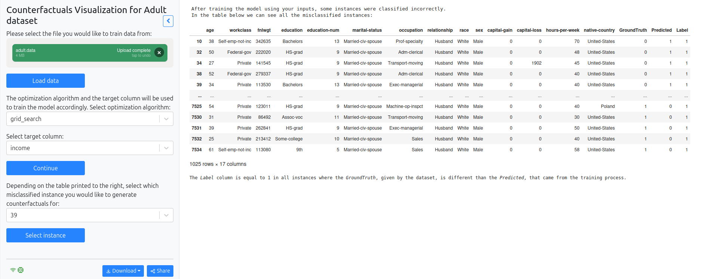
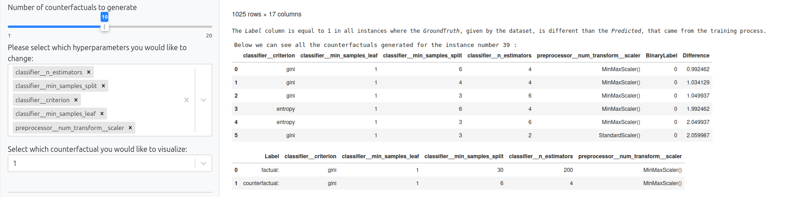
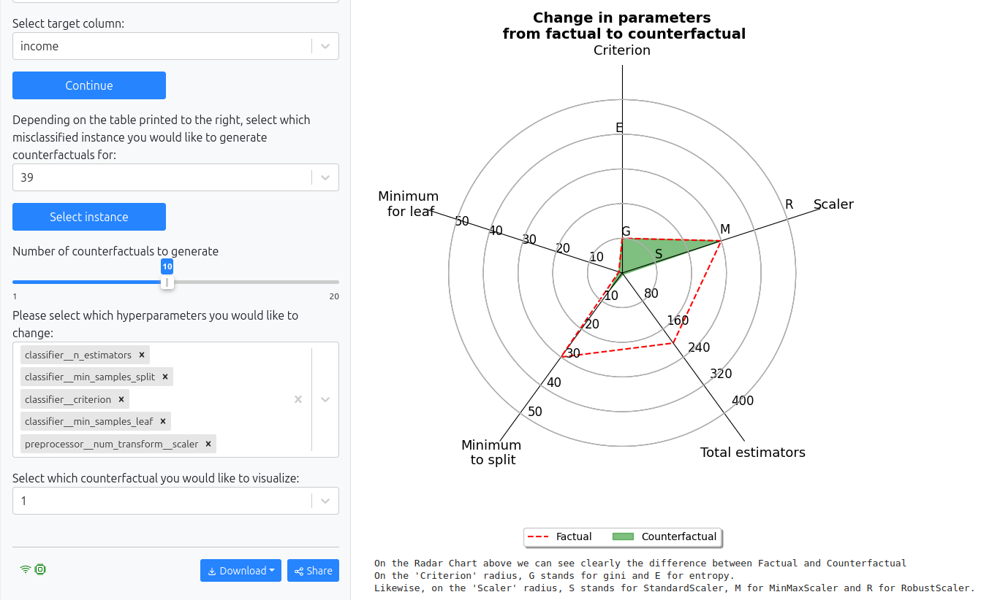
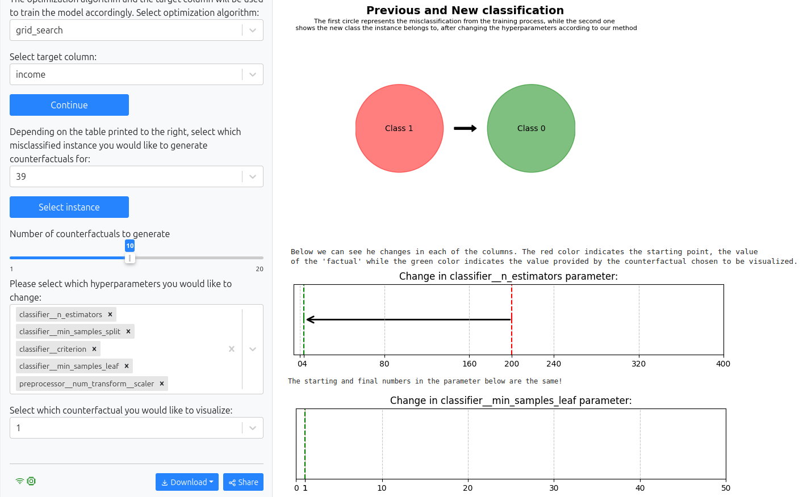
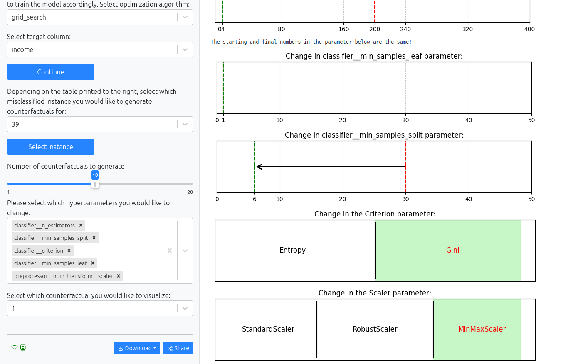
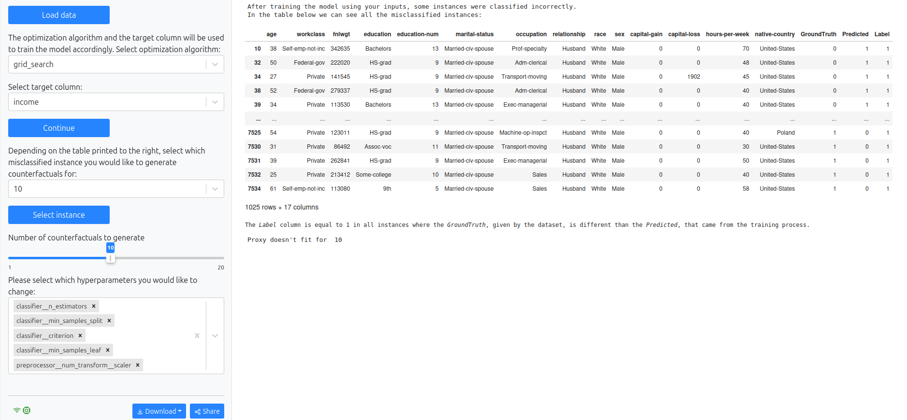
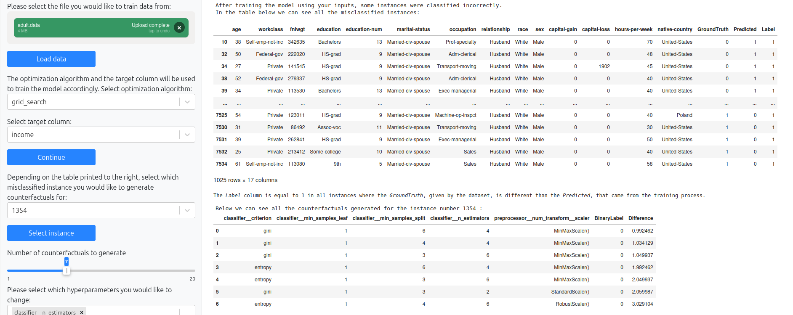
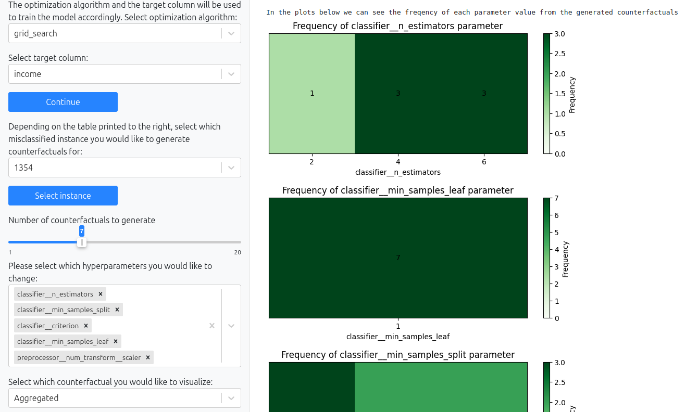
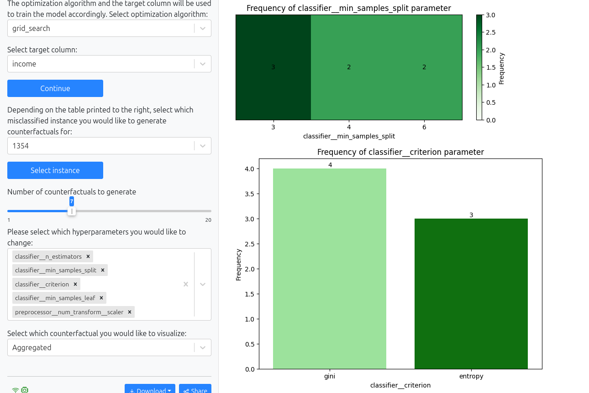
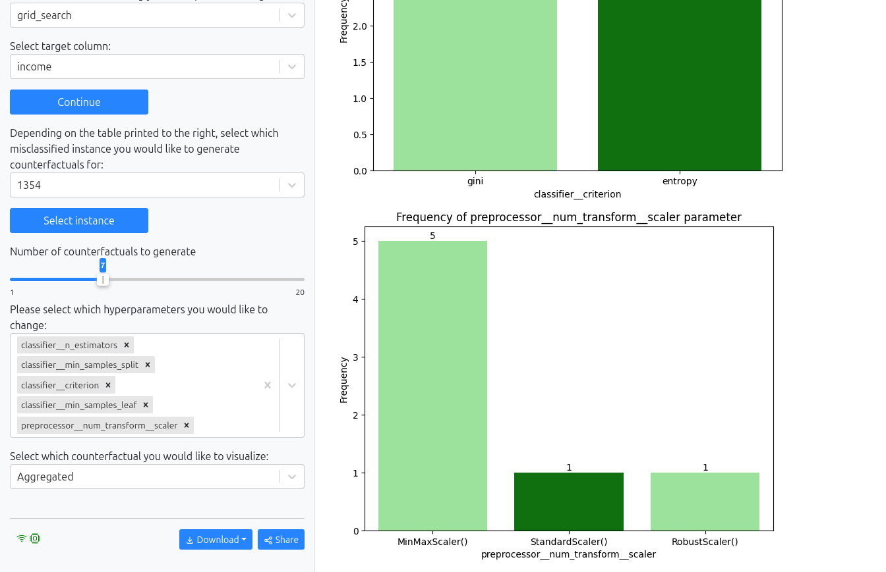

# Counterfactual Explanations for Machine Learning models

<i> The given repository is a representation of my MSc Thesis "nteractive Visualization of Explanations for Machine Learning models" </i>

## Abstract 
The rapid adoption of Machine Learning (ML) models across various sectors necessitates a deeper understanding of their decision-making processes to ensure transparency and build trust. This thesis explores the domain of interpretability in ML, focusing on visualization techniques and the novel approach of Counterfactual Explanations. Visualization techniques, such as graphs and interactive diagrams, transform abstract algorithms into comprehensible formats, enabling users to understand the factors driving model predictions. This is critical for applications in fields where decisions and their outcomes directly influence human lives and societal outcomes.

This research introduces a system for generating Counterfactual Explanations for hyperparameters. Utilizing a proxy model and the dice-ml library in Python, the proposed methodology systematically explores Counterfactual scenarios, offering valuable insights into the decision-making mechanisms of ML models. By visualizing differences between factual and Counterfactual hyperparameters, users can better understand the model's behavior and the factors influencing its predictions.

The thesis demonstrates the application of this method using the "Adult" dataset from the UCI Machine Learning Repository. The User Interface (UI) created, allows users to produce Counterfactual Explanations and select which ones to visualize. The results underscore the effectiveness of visual explanations in enhancing interpretability and facilitating informed decision-making. The findings contribute to the broader field of explainable AI, providing practical tools and methods for improving transparency and accountability in ML systems.

Overall, this work aims to bridge the gap between complex Machine Learning algorithms and the need for understandable and actionable insights, making a significant contribution to the development of more interpretable and trustworthy AI technologies.

## Methodology

The methodology focuses on generating Counterfactual Explanations for misclassified instances in a Machine Learning pipeline using the DiCE technique via the dice-ml library. This approach creates diverse Counterfactual examples that vary significantly in features but remain close to the original data. These explanations help explore how changes in hyperparameters might correct misclassifications.

The methodology follows a structured approach, beginning with the optimization of hyperparameters for the Machine Learning pipeline using techniques such as Grid Search or Bayesian Optimization. This initial phase ensures that the model is fine-tuned for optimal performance. The optimized model is then employed to identify misclassified instances, which serve as the starting point for generating Counterfactual Explanations. A proxy model is then built, which mimics how the original model makes decisions close to the misclassified instance. This proxy model enables the efficient generation of Counterfactual examples that investigate different hyperparameter settings, by simulating the decision-making process of the original model, in the vicinity of the misclassified instance.

<h3> Optimal hyperparameter combination and model creation </h3>

The first step in our methodology involves establishing an efficient Machine Learning pipeline by selecting appropriate algorithms, regularization parameters, and preprocessing techniques, followed by hyperparameter tuning to optimize performance. This process employs methods like Grid Search and Bayesian Optimization to systematically explore the hyperparameter space. Grid Search exhaustively tests all possible combinations, typically returning the one with the best accuracy, while Bayesian Optimization, balances accuracy with runtime efficiency, by identifying patterns in the hyperparameter space. Although we focus on these techniques, others like Random Search and Genetic Algorithms are also viable options. Before tuning, the dataset is split into training and validation sets to ensure the model is evaluated on unseen data, enhancing the accuracy of performance assessment. For classification, we use a Random Forest classifier, which combines multiple decision trees to improve predictive accuracy and mitigate overfitting. The key hyperparameters for the Random Forest, crucial to its performance, are detailed in the following table.

| Hyperparameter      | Values                                          | Explanation                                                                                          |
|---------------------|-------------------------------------------------|------------------------------------------------------------------------------------------------------|
| Scaler              | "StandardScaler", "MinMaxScaler", "RobustScaler" | Preprocess numerical features to ensure they are on the same scale                                   |
| Criterion           | "Gini", "Entropy"                               | Measures how the quality of a split is determined                                                    |
| N_estimators        | Integer                                         | Specifies how many trees are included in the ensemble, with more trees potentially leading to better performance |
| Min_samples_split   | Integer                                         | Controls the minimum number of samples required to split an internal node                            |
| Min_samples_leaf    | Integer                                         | Sets the minimum number of samples required in a leaf node, influencing model complexity |

In the code implementation, a parameter grid is defined using the above hyperparameters, specifying the range of hyperparameter values to be explored. These hyperparameters collectively influence the performance and behavior of the classifier during training and inference. The result given from the pipeline steps described above, is the best optimized hyperparameter combination for the given dataset

<h3> Model training and misclassified instances extraction </h3>

The best combination of hyperparameters, as resulted from above, is used to train the model. This training process involves fitting the Random Forest classifier to the training data, allowing it to learn patterns and relationships within the features to make predictions. After the model is trained, we extract the misclassified instances that will be used later on for the Counterfactual generation.
To identify misclassified instances, we compare the target column of the model's predictions on the validation set, with the Ground Truth labels in the dataset. Any instance where the predicted label differs from the Ground Truth, is considered misclassified. The misclassified instances are placed in a DataFrame and will be used later for the generation of Counterfactual Explanations.

<h3> Proxy model creation and Counterfactual generation </h3>

In our methodology, a proxy model serves as a surrogate to the original model, facilitating the generation of Counterfactual Explanations. We start by selecting a misclassified instance and creating a proxy model using a simple, interpretable approach, such as Logistic Regression, to balance model complexity with clarity. This proxy model helps explore the decision boundaries of the original model.

To optimize efficiency, we implemented a caching mechanism to reuse pre-trained models, reducing retraining time and computational costs. The proxy model predicts outcomes for various hyperparameter configurations, and these predictions are stored in a new column of the proxy dataset. 

Once the proxy model is trained, we use the dice-ml library to generate Counterfactual Explanations, allowing us to define desired outcomes and select which hyperparameters to modifyIn this phase, three potential outcomes may arise: Firstly, Counterfactual Explanations are successfully generated for the misclassified instance. Secondly, there is the possibility that the proxy model fails to fit the instance, indicating challenges in modeling the decision boundaries. When the proxy model does not fit, it actually means that this simpler model fails to learn and find patterns in the given data. As a result, the proxy cannot mimic the original model’s decisions, therefore it cannot produce accurate results. Some possible reasons for this could be insufficient data, model issues such as underfitting or overfitting or even the proxy model selected not being the best suited for this task. Lastly, there exists the scenario where the dice-ml library encounters limitations in producing Counterfactual Explanations for the specific instance, potentially due to complexities in the data or constraints within the library's capabilities. In this part it is important to mention that the version of dice-ml used in our implementation is v0.11, which is the latest release at the time of writing. As this library was first introduced in 2020, it is still in an early stage of development and we anticipate more updates and additional features in the future.

Finally, the generated Counterfactuals are presented in a table, ranked by their similarity to the original instance (factual). We focus on those with minimal differences that still achieve the desired outcome, using a cost function to quantify changes: for numerical features, the cost is the normalized difference, and for categorical features, a difference of 1 if they differ or 0 if they remain the same.

After the Counterfactual generation, we can visualize the changes between the factual and each Counterfactual or even some aggregated statistics, for a more general view of how each hyperparameter changed to provide the desired outcome. 

## Experiments

The experiments conducted, focused on optimizing the process of generating Counterfactual Explanations for misclassified instances in ML models. The primary objectives were to identify the best hyperparameter settings and the most suitable classifier for the proxy model used in generating these explanations. Three different parameter grids were tested, alongside two optimization techniques, Grid Search and Bayesian Optimization. Additionally, two classifiers, Support Vector Machines (SVM) and Logistic Regression, were evaluated as proxy models.

The experiments began with exploring three distinct parameter grids, each progressively broader in scope. The first grid provided a basic set of values, while the second and third grids expanded the range, allowing for a more thorough exploration of hyperparameters. The broader grids, especially the third one, offered the potential for capturing complex patterns but came at a higher computational cost. The results showed that although the third grid was computationally expensive, it yielded more Counterfactual Explanations, particularly when combined with Grid Search.

In comparing the classifiers, Logistic Regression outperformed SVM in terms of both efficiency and effectiveness in generating Counterfactual Explanations. Logistic Regression's simplicity and computational efficiency made it a better fit for the iterative nature of the Counterfactual generation process. It also offered better interpretability, which is crucial for generating explanations that are easy for users to understand. Consequently, Logistic Regression was chosen over SVM for subsequent experiments.

Across all experiments, Bayesian Optimization consistently proved faster than Grid Search in finding optimal hyperparameters and generating Counterfactuals. However, Grid Search generally produced a higher number of Counterfactuals. The results varied in terms of accuracy, with some experiments favoring Grid Search and others Bayesian Optimization. Ultimately, the third experiment, which used the broadest parameter grid with Grid Search and Logistic Regression, emerged as the most suitable approach. It struck a balance between generating a large number of Counterfactual Explanations and achieving reasonable accuracy, aligning with the primary goal of enhancing model interpretability for a wider range of predictions.

## User interface and Visualization 

To make the above Methodology available for users, we employed the Python library called mercury, which will assist in creating a user interface, based on our code and provide an interactive module for the final user. 

The architecture behind our system is designed to provide an interactive and user-friendly environment for training Machine Learning models, generating Counterfactual Explanations and visualizing the results. The primary goal of this method is to enhance the interpretability and transparency of Machine Learning models, allowing users to gain insights into the decision-making process and identify potential changes to obtain desired outcomes.

For the process to be initiated, the user is required to import a dataset into the Python module, through the Graphical User Interface we have created. The Python module serves as the core engine, responsible for various tasks such as data preprocessing, model training and generating Counterfactual Explanations. It leverages popular libraries like pandas, numpy, Scikit-learn, as well as seaborn and matplotlib for visualization purposes. The rest of the steps are repeated interactions between the user and the Ui module, which then sends the according inputs to the Python module. The python module then returns the according outputs that are given to the user as explanations for the Machine Learning model trained.

In short, the picture below shows the architecture behind the created system:

## Use Case - Adult dataset

We applied our method on the “Adult” dataset from UCI Machine Learning Repository. This dataset contains 32561 rows and 14 columns with both numerical and categorical data. The target column takes two values, >50K or <=50K, as the dataset is used for classification tasks. Each row represents a different person and the columns contain that person’s data. Given the features from the columns, the model has to predict whether the person’s income exceeds 50.000 dollars in a year, or not.

<h3> Demonstration 1 - Visualizing changes for one of the Counterfactuals </h3>

In the first demonstration, we will focus on visualizing changes for one of the generated Counterfactuals. 

We begin by importing the dataset of our choice while also selecting the target column and the optimization algorithm. After each step, clicking the Blue button below it, is required for the program to load and proceed to the next part. In this example, we have imported the “Adult” dataset for the demonstration process. As seen on the figure below, the dataset has been imported and we have selected both the optimization algorithm and the target column. In this case, we selected the grid Search algorithm, to find the best hyperparameter combination to train our data. We have also specified the target column as the preprocessed "income" column.

After these steps, some messages as well as a table will be printed on the right side of the screen. These messages explain to the user, that the model was trained according to the inputs given in the previous steps, but some instances were not classified correctly. To be exact, there are 1025 instances that were misclassified. These instances are then printed in the table, accompanied by their features as well as the predicted and actual labels. Above we have mentioned that each one of these rows represent a different person and their data and the classification goal is to predict whether each person makes more or less than 50000 dollars in a year. That means that the printed table contains all people that the model placed in the wrong class. For example, the instance with index 39, has a GroundTruth label 0 but predicted 1. The model predicted that this one person makes <b> more than 50000 dollars in a year </b>, when they actually <b>do not </b>. Our goal now is to find, through Counterfactual Explanations, which hyperparameters should have been used in the training process, for that one instance to have been classified correctly. It is important to note that the optimization algorithm chosen by the user, finds the best hyperparameter combination for the dataset which means the best accuracy. No matter the hyperparameter combination, there will always be misclassified instances, as it is almost impossible to have an accuracy of 100%.

From the printed table of misclassified instances, the user has to select a row of their likings to proceed to the Counterfactual generation process. This is done using the indexes in the printed table, which are found in the first column of the table and are in bold characters. Below the algorithm and target column selection part, on the bottom left part of the previous figure, the user has to select from a list of all indexes, the one of their likings. We proceed by selecting the instance with index 39 and clicking on the “Select instance” button.

After the selection of the instance, as explained above, the Counterfactual Explanations are generated for that specific row. As default, the program generates 10 Counterfactual Explanations and has the freedom of changing all five of the hyperparameters to find the best combination. 

In the figure above, we chose to request for 12 Counterfactuals to be generated and give the program the freedom to change only three of the hyperparameters, n_estimators, min_samlpes_split and criterion. After the generation, we notice that only 8 Counterfactual Explanations are printed in a new table that appears to the right side of the screen. That is the case of the dice-ml dictionary not being able to find as many Counterfactuals as requested from the user, so it returns as many as it can. The Explanations are printed in ascending order depending on their difference to the original hyperparameter combinations used to train the model. This means that the first row of the new table shows the Counterfactual explanation with the least difference from before, that will however produce a different outcome in the classification process. Also, a new column is introduced by the name “BinaryLabel”. This column shows the predicted label of the Counterfactual Explanation.

Below the two choices given to the user, regarding the number of Counterfactuals to be generated and the hyperparameters to be changed, follows another choice, the last given to the user. In this part, the user is given a list of the number of Counterfactuals generated, from which they have to choose which one to visualize. Again, by default, the program displays the visualization of the first Counterfactual Explanation, the one with the least difference from the original hyperparameters combination, but we chose to display the 7th Counterfactual generated to give more variety to the demonstration. The visualization process begins with a table comparing the factual (original combination) and Counterfactual (new combination). This makes it easier for the user to understand in a numerical form before proceeding to the visuals. In the case of the figure above, in the table that shows the difference between factual and Counterfactual, we notice that there is a change in the criterion hyperparameter, from “Gini” to “Entropy”, a decrease in the min_samples_split hyperparameter, as well as in the n_estimators one. A decrease from 50 to 18 in the least samples needed for a split, means that there will be many more splits, resulting in more complex trees. Also, there is a decrease in the number of trees from 200 to only 2. Even though the trees are smaller in number, it is important to note that, because of the decrease in splitting number, they are definitely deeper. The other two hyperparameters stayed the same as they were excluded from being changed.

By scrolling through the above tables, we meet the spider plot. This plot, also known as a radar plot, depicts visually the difference between factual and Counterfactual, for all hyperparameters as a group. Each arch represents a different hyperparameter and is scaled differently. For hyperparameters that take categorical values, the scaling was made according to the number of values they take and separated equally. In the “Criterion” hyperparameter, G stands for “Gini” while E stands for “Entropy” and in the “Scaler” hyperparameter S, M and R stand for “Standard Scaler”, “MinMax Scaler” and “Robust Scaler” accordingly. On the spider plot, we can see a red line, which represents the factual and a green shape, which represents the Counterfactual explanation the user chose to visualize.

Below the spider plot is a quick visualization of the change in class, to show to the final user, that the Counterfactual combination of hyperparameters would indeed have changed the class of the selected instance, if the model was trained using them. In this case, the originally predicted class was 1 and it is shown in the red circle, while the new predicted class is 0 and it is shown in the green circle.

Last but not least, after the change in the class, we depict the changes in each hyperparameter individually. For numerical values, the change is shown in a numerical axis, which takes values depending on each hyperparameter’s minimum and maximum value. On these axes, there is a red line and a green line representing the factual and Counterfactual accordingly, as well as an arrow pointing towards the right direction to make it more clear. For example, we see in the n_estimators hyperparameter, the change from 200 to 2. In the next case of the min_samples_leaf hyperparameter, there was no change and that is why the message “The starting and final numbers in the parameter below are the same” appears before the axis. In the figure below, we can also see the visualization of changes in the rest of the hyperparameters.

In the min_samples_split hyperparameter the change is again clear from 50 to 18. Finaly, in the case of categorical values, as the criterion and scaler hyperparameters, the axis could not be used. Instead, the values each hyperparameter takes were separated into different boxes. The red colored letters represent the factual while the green background represents the Counterfactual. If a box is both green and contains red letters, it means that the factual and Counterfactual values are the same. In the previous figure, the criterion parameter changed from “Gini” to “Entropy” while the factual and Counterfactual values of the scaler parameter remained the same.

As mentioned in the methodology part, there are three possible outcomes in generating Counterfactuals. Above we explained the scenario of Counterfactuals being generated correctly and now we will briefly present the other two scenarios.

In both cases of either the proxy model not fitting or Counterfactuals not being found by the program, the process stops after the selection of the misclassified instance and the according message appears, either "Proxy doesn’t fit for {index of misclassified instance}" or "No counterfactuals found for {index of misclassified instance}". Below is an example picture of the proxy not fitting for misclassified isntance number 10:

<h3> Demonstration 2 - Visualizing aggregated changes for all the Counterfactuals generated </h3>

In this second demonstration, we will present the aggregated changes in all Counterfactuals generated for that one selected misclassified instance. In other words, this approach allows the user to observe the suggested changes in hyperparameters collectively for all the Counterfactuals generated by the program.

We begin the process by following the same steps as explained in the previous chapter, in Counterfactual generation. Selecting the dataset to import data from, choosing the optimization algorithm and target column and finally choosing the misclassified instance from which to generate Counterfactual Explanations.

In this case, we have selected misclassified instance number 1354. This instance was selected as it generates Counterfactuals with bigger difference values than the ones chosen before. After selecting the number of Counterfactual Explanations to generate, on the right side of the figure above, appears the table with all Counterfactuals generated. We notice that, indeed, the difference values reach up to 3, which is bigger than the values presented in previous examples.

Proceeding, it is important to	 mention that, as seen on the left side of the figure above, we allowed the program to change all hyperparameters to create combinations with bigger difference value. On the “Select which counterfactual you would like to visualize” choice, after a scroll down, appears the choice “Aggregated”, which will provide us with a group of visual representations of the collective changes made in hyperparameters. For the hyperparameters that take numerical values, the program creates heatmap-like plots. These plots present a matrix from the frequency counts of each unique value, accompanied by shades of the color green to show the frequency of each value. A darker green shade represents a higher frequency, while a lighter shade, a lower frequency. Notably, the sum of all values corresponds to the total number of Counterfactual Explanations generated, which in this case is 7. 

We begin with the visualization of the n_estimators hyperparameter. We notice that the value 2 appears only once, while the values 4 and 6 appear 3 times each. This indicates that the values 4 and 6 were more commonly used in the hyperparameter combinations created. Consequently, these values are likely better fitting the proxy model created for the misclassified instance selected above. The higher frequency of these values suggests they were more effective during the hyperparameter tuning process, potentially leading to more accurate and stable predictions.

On the other hand, while examining the visual representation of value frequency for the min_samples_leaf parameter, only the value 1 appears, with a frequency of 7. This means that all the Counterfactual Explanations generated used a min_samples_leaf value of 1. The fact that only one value appears suggests that this specific setting was consistently optimal or required across all generated Counterfactuals. It indicates a preference for having at least one sample in each leaf node during the tree splitting process.

Continuing on the next figure , we examine the visualization of the min_samples_split parameter. Notably, the frequency of value 3 appears three times, while both values 4 and 6 occur twice. This indicates a preference for the value 3 within the hyperparameter combinations generated. Hence, it is likely a better fit for the proxy model constructed to address the misclassified instance discussed earlier. The prevalence of 3 implies its effectiveness during hyperparameter tuning, potentially leading to more accurate and consistent predictions. 

After analyzing the visual representations of all numerical hyperparameters, the next examination focuses on those that are categorical. In this case, we created bar plots based on the frequency of each categorical value. The colors of light green and darker green in this case, were used solely for the purpose of visually distinguishing each bar from the others. In the Figure below, we begin with the visualization of the criterion hyperparameter. Notably, the frequency of "Gini" appears 4 times, whereas "Entropy" occurs 3 times. This suggests a preference for the "Gini" criterion within the hyperparameter combinations generated. Consequently, it is likely a more suitable choice for the proxy model developed to address the previously mentioned misclassified instance. The higher frequency of "Gini" implies its effectiveness during hyperparameter tuning, potentially resulting in more accurate and consistent predictions. 

In this last figure, appears the last visualization of our program, regarding the scaler hyperparameter. The frequency analysis reveals "MinMax Scaler" as the predominant choice, appearing 5 times, while both "Standard Scaler" and "Robust Scaler" occur only once each. This distribution underscores a clear preference for "MinMax Scaler" within the generated hyperparameter combinations. Consequently, it suggests that "MinMax Scaler" is a more favorable choice for the proxy model devised to address the previously mentioned misclassified instance. The higher frequency of "MinMax Scaler" implies its efficiency during hyperparameter tuning, resulting in more precise and stable predictions. 

## Conclusions

Summarising, we focused on generating Counterfactual Explanations for misclassified instances in Machine Learning models, comparing optimization techniques (Grid Search and Bayesian Optimization) and evaluating classifiers like Support Vector Machines (SVM) and Logistic Regression as proxy models. We found that Logistic Regression, despite being simpler, performed better as a proxy model. While Bayesian Optimization was faster, Grid Search more effectively generated Counterfactual Explanations for misclassified instances. Challenges arose due to poor proxy model fits or limitations in the dice-ml library, indicating areas for improvement in Counterfactual generation.

Additionally, we developed an interactive system for visualizing these explanations, allowing users to make informed decisions about model training and interpretation. This system uses tables and graphs to clearly present the impact of Counterfactual Explanations, enhancing the overall interpretability of Machine Learning models.